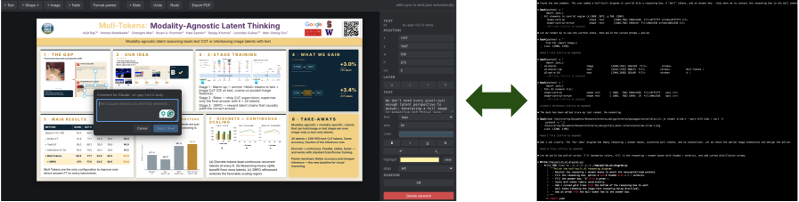

# Minerva: Human-`agent` Collaborative Slides

<p align="center">
  
</p>

Slides live as a portable JSON file (`deck.json`) inside a Minerva project. Humans drag, type, and style in a WYSIWYG canvas. Claude Code, running in the same folder, edits the same file — and uses the editor's renderer as ground truth for what the slide actually looks like, not a hallucinated HTML mock-up.

## Setup

Clone the repo, then pick whichever flow fits how you work. The first run installs dependencies and builds (~30s); after that, `./minerva` is instant.

```bash
git clone https://github.com/arijitray1993/minerva.git my-deck
cd my-deck
```

### A. Paste into Claude Code (recommended)

```bash
claude
```

```text
> Run `./minerva` in the background, then read MINERVA.md and follow it.
```

Claude starts the server, opens the editor in your browser, reads the `MINERVA.md` guide that gets scaffolded next to your deck, and waits for your next request.

### B. Run it yourself, then open Claude

```bash
./minerva
# in another terminal:
claude
```

Either way, the cloned dir now contains your deck alongside the editor source:

```
deck.json       slide content (live-reloaded on edit)
assets/         images (drop files here or paste/upload in the UI)
comments.json   feedback you leave for Claude from the editor
MINERVA.md      the rules Claude follows when editing this deck
.minerva/       per-slide PNG previews + the server's port breadcrumb
packages/       editor source — off-limits to Claude
```

The editor URL prints to the terminal — by default <http://localhost:5174>, but Minerva auto-walks forward (5175, 5176, …) if that port is taken, so you can run multiple decks side-by-side without conflict.

## Multiple decks

Each deck is its own cloned folder. Clone again into a different directory:

```bash
git clone https://github.com/arijitray1993/minerva.git deck-research
git clone https://github.com/arijitray1993/minerva.git deck-talk
cd deck-research && ./minerva &     # picks 5174
cd ../deck-talk    && ./minerva &   # picks 5175 (5174 is busy)
```

Both servers know their own port via `.minerva/server.json`, so Claude's `./minerva render slide-1` always talks to the right one. No `--port` juggling.

## What this gives you

- **A real WYSIWYG editor.** 30 shapes, rich text (font, size, color, bold/italic/underline/strike, super/sub, highlight, alignment), tables, images via drag-drop / paste / upload, drop shadows, corner radius, opacity, layer ordering, group/ungroup, zoom + pan, undo/redo, format painter.
- **Claude as a competent collaborator.** Right-click any element → "Leave Claude comment…" to scope a request. Claude reads `comments.json` on session start, edits `deck.json`, renders the slide to PNG, looks at the PNG, and iterates against the actual rendered output — not a hallucinated HTML preview.
- **One file is the whole deck.** `deck.json` is portable. Diff it, commit it, copy it between machines. No database, no SaaS account, no lock-in.
- **PDF export that looks like the canvas.** Playwright drives the same `/print` route to produce a faithful, slide-only PDF.

## How the human ↔ Claude loop works

1. You select something in the editor, right-click, and pick **"Leave Claude comment…"**.
2. The editor writes an entry to `comments.json` with the slide id, the selected element ids, and your request.
3. Claude reads `comments.json` (the rules in `MINERVA.md` tell it to read this on every session) and finds those elements in `deck.json` by id.
4. Claude edits `deck.json`. The editor live-reloads via WebSocket so you see the change instantly.
5. Claude runs `./minerva render <slide-id>` to write a PNG to `.minerva/`, opens the PNG, and verifies the result before marking the comment resolved.

The visual feedback loop is the important part. Claude is **explicitly told not to invent its own HTML/CSS preview** — those would measure text differently, fall back to different fonts, and lie about layout. The only acceptable preview is the PNG rendered by the actual editor.

## Requirements

- **Node 18 or newer.**
- A Chromium build, used by PDF export and PNG rendering. Minerva looks for one in this order:
  1. `$MINERVA_CHROMIUM` env var
  2. Playwright's cache (`~/.cache/ms-playwright/chromium-*`)
  3. System Chrome / Chromium (`/Applications/Google Chrome.app`, `/usr/bin/google-chrome`, etc.)

  If none of these resolve, install one with:

  ```bash
  npx playwright install chromium
  ```

## `./minerva` — what it does

```text
./minerva                          # start the editor with the deck at the repo root
./minerva start [dir]              # explicit deck dir
./minerva render <slide-id|all>    # render via the running server (auto-detects port)
./minerva init [dir]               # just scaffold deck.json, MINERVA.md, etc.
./minerva --port 5180              # pin to a specific port (fails if busy)
./minerva --no-open                # don't open a browser tab
```

First invocation runs `npm install` + `npm run build:workspaces`. After a `git pull` that touched `packages/`, re-run `npm run build:workspaces` to pick up renderer changes.

## Source layout

- `packages/schema` — Zod schema + types for `deck.json` and `comments.json`. The source of truth for the deck format.
- `packages/server` — Express + chokidar + ws + Playwright. Watches the deck, serves the UI, exports PDF, renders PNG previews.
- `packages/web` — Vite + React + Konva. The WYSIWYG editor.
- `minerva` — the shell entrypoint described above.
- `scripts/build-publish.mjs` — kept for a future npm publish; not used in the github-install flow.

## License

MIT.
